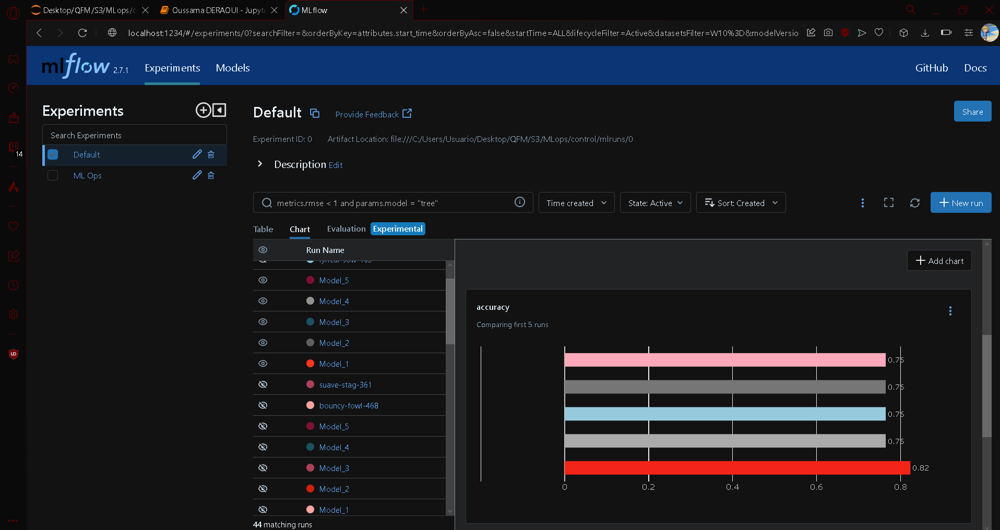
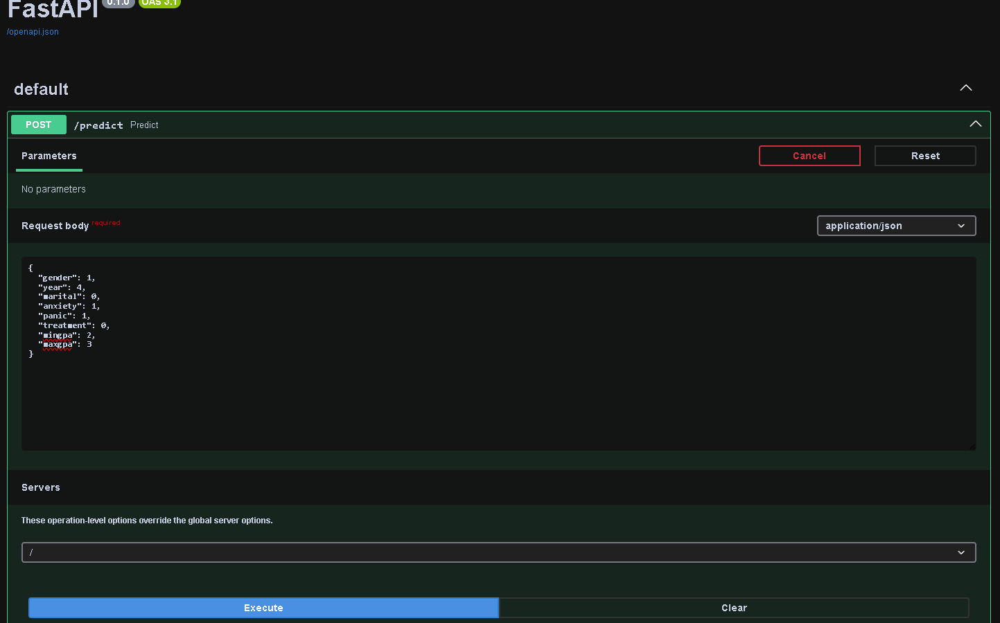
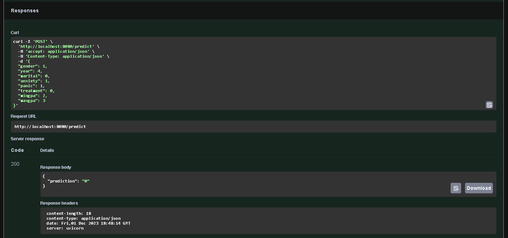
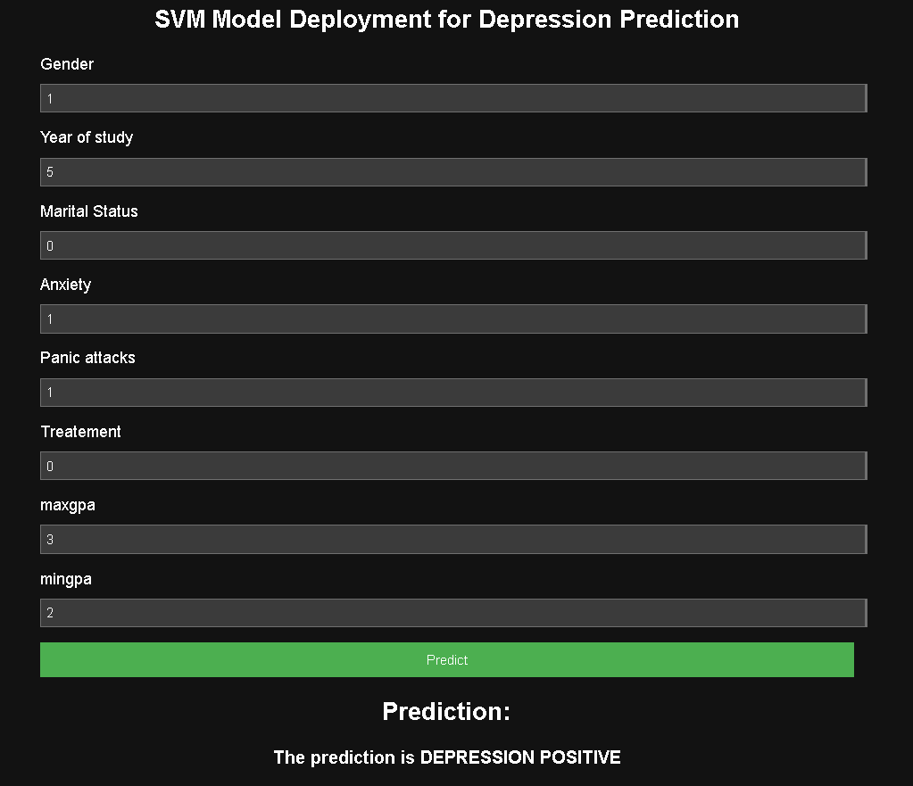

# Project Overview: Building a Scalable ML Model Deployment Pipeline

## Introduction:

In the evolving landscape of machine learning, deploying models efficiently and reliably is crucial. This project aims to create a streamlined pipeline for training, tracking, deploying, and consuming machine learning models using modern tools and frameworks.

The project leverages MLflow, a powerful open-source platform for managing the end-to-end machine learning lifecycle. It enables experimentation tracking, packaging code, and sharing models seamlessly. Additionally, FastAPI, a high-performance web framework for building APIs, serves as the bridge between the trained models and end-users, ensuring rapid and scalable model deployment.

## About Dataset
A statistical research on the effects of mental heatlh on students cgpa and depression dataset. This Data set was collected by a survey conducted by Google forms from University student in order to examine their current academic situation and mental health.

## Project Objectives:

### Data Preprocessing and Model Training:

Utilize MLflow to preprocess data and train multiple machine learning models.
Track model performance, hyperparameters, and versions using MLflow's tracking capabilities.

### Model Serialization and Deployment:

Identify and save the best-performing model in ONNX format using MLflow.
Serialize preprocessing transformations using the transformers API and save in pickle format.

### FastAPI Integration for Model Serving:

Develop a FastAPI application to serve the serialized model.
Create robust API endpoints to accept input and provide model predictions in real-time.

### Containerization with Docker:

Package the FastAPI app, serialized model, and preprocessing transformations into a Docker container for easy deployment and scalability.

### Postman Validation and Flask Consumption:

Validate the APIs using Postman by sending requests and receiving predictions.
Develop a Flask application to consume the FastAPI-based model endpoints, showcasing a user-friendly interface for model consumption.

## Ml Flow
Here is a screenshot of the mlflow logging accuracy results :

## Fastapi
Here is screenshots of an input prediction in fastapi :

## Flask7

Here is screenshots of an input prediction in flask and its index html form :

